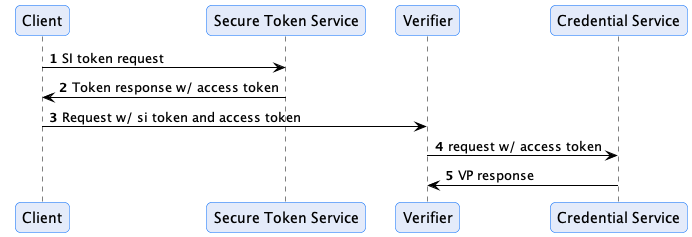

# 1. Introduction

This specification defines a protocol for storing and presenting Verifiable Credentials (VC) and other identity-related
resources. The Verifiable Presentation Protocol (VPP) covers the following aspects:

- Endpoints and message types for storing identity resources belonging to a holder in a `Credential Service`
- Endpoints and message types for resolving identity resources
- Secure token exchange for restricting access to CS endpoints

> Note that management endpoints for creating resource contexts, deleting resources, and defining access control are
> beyond the scope of this protocol.

## 1.1. Motivation

The Verifiable Presentation Protocol (VPP) is designed to address the problem of resolving Verifiable Presentations and
other claims when they cannot be passed as part of a client request. For example, VPs often cannot be passed as part of
an HTTP message header due to size restrictions. The protocol provides a secure mechanism for endpoints to resolve
client resources. As part of this issue, the VPP also addresses how VC issuers can request the holder's CS to store
issued credentials.

## 1.2. Terms

- **Credential Service** - A network-accessible service that manages identity resources.
- **Holder** - An entity that possesses a set of identity resources as defined by
  the [W3C VC Data Model](https://www.w3.org/TR/vc-data-model/#dfn-holders). The holder will typically be the subject of
  a VC.
- **Resource** - A resource is an entity managed by the Credential Service such as a Verifiable Credential (
  VC) or Verifiable
  Presentation (VP).
- **Subject** - The target of a set of claims contained in a VC as defined by
  the [W3C VC Data Model](https://www.w3.org/TR/vc-data-model/#dfn-subjects). In a dataspace, a subject will be a
  participant.

## 1.3. Json-Ld Context

The VPP is based on Json-Ld message types. The CS Json-Ld context is:

`https://w3id.org/tractusx/2023/cs/v1`

## 1.4. The Base URL

All endpoint URLs in this specification are relative. The base URL is implementation specific and may include
additional context information such as a sub-path that disambiguates a holder.

# 2. Presentation Flow

Below is a sequence where the client uses the OAuth 2 client credential grant flow as defined in
the [Identity Protocol Base Specification](identity.protocol.base.md):



In the above sequence, the STS acts as an authorization endpoint for the client CS. The client requests a self-issued
token including the `bearer_access_scope` authorization parameter set to an array of scopes that define the VPs the
client wants the Verifier to have access to. This list of scopes is determined out of band and may be derived from
metadata the verifier has previously made available to the client.

The client receives the Self-Issued ID Token (containing an access token based on the `bearer_access_scope` value) and
provides it with a request to access protected resources to the verifier. The verifier extracts the access token and
uses it to request VPs from the client's CS. The verifier may resolve the CS endpoint through a variety of methods,
for example, by resolving the client's DID document and using a service entry as described
in [Section](#6-cs-endpoint-resolution-through-did-documents). The VPs are then returned to the Verifier.

# 3. Security

CS endpoints may require an [OAuth 2](https://www.rfc-editor.org/rfc/rfc6749) access token obtained from the resource
owner. For example, a client (the resource owner) that needs to present a VP to an endpoint will provide an access token
to the endpoint. The endpoint server will in turn use the access token when resolving the VP through a request to the
client's Credential Service.

Tokens may be [OAuth 2.0 Bearer Tokens](https://www.rfc-editor.org/rfc/rfc6750) or any other valid OAuth 2.0 token type.
Any OAuth 2.0 grant type may be used to request the access tokens.

## 3.1. Access Scopes

Scopes are used to specify access privileges. A scope is a string value in the form:

`[alias]:[descriminator]:[read|write|all]`

The `[alias]` value may be implementation-specific. The `all` value indicates both read and write access.

### 3.1.1. The `org.eclipse.tractusx.vc.type` Alias

The `vc.type` alias value must be supported and is used to specify access to a verifiable credential by type. For
example:

`org.eclipse.tractusx.vc.type:Member:read`

denotes read-only access to the VC type `Member` and may be used to request a VC or VP.

### 3.1.2. The `org.eclipse.tractusx.vc.id` Alias

The `org.eclipse.tractusx.vc.id` alias value must be supported and is used to specify access to a verifiable credential
by id. For example:

`org.eclipse.tractusx.vc.id:8247b87d-8d72-47e1-8128-9ce47e3d829d:read`

denotes read-only access to the VC identified by `8247b87d-8d72-47e1-8128-9ce47e3d829d` and may be used to request a VC
or VP.

### 3.1.3. The `*` Wildcard Alias

Implementations must also support the `*` wildcard:

`org.eclipse.tractusx.vc.type:*:write`

The above expression enables write-only access to all VCs.

## 3.2. Access Control

How access control is defined in a Credential Service is implementation-specific. Implementations may
provide the ability to selectively restrict access to resources. The access control mechanism must support the scope
restrictions defined in [Section 3.1](#31-access-scopes). Implementations may support additional restriction methods,
including requiring the requester to present its own VPs.

# 4. Resolution API

If a client is not authorized for an endpoint request, the Credential Service may
return `4xx Client Error`. The exact error code is implementation-specific.

## 4.1. Presentations

### 4.1.1. Query For Presentations

Presentations can be queried by POSTing a message to the query endpoint:

`POST /presentations/query`

```json
{
  "@context": [
    "https://w3id.org/catenax/2023/cs/v1",
    "https://identity.foundation/presentation-exchange/submission/v1"
  ],
  "@type": "Query",
  "presentation_definition": "...",
  "scope": []
}
```

A `Query` MUST contain either a `presentation_definition` or a `scope` parameter. It is an error to contain both.

### 4.1.1.1. Presentation Definitions

Implementations MAY support the `presentation_definition` parameter. If they do not, they MUST
return `501 Not Implemented`. The `presentation_definition` parameter contains a valid `Presentation Definition`
according to
the [Presentation Exchange Specification](https://identity.foundation/presentation-exchange/spec/v2.0.0/#presentation-definition).
The CS may require an authorization token to authorize the request and uses the presentation definition to return a set
of matching VPs in the format specified by the definition.

### 4.1.1.2. Scopes

Implementations MAY support requesting presentation of Verifiable Credentials using OAuth 2.0 OAuth 2.0 scope values.

Such a scope value MUST be an alias for a well-defined Presentation Definition. The specific scope values, and the
mapping between a certain scope value and the respective Presentation Definition is out of scope of this specification.

### 4.1.1.3. Response

The response type of a presentation query is defined by
the [OpenID for Verifiable Presentations specifications](https://openid.net/specs/openid-4-verifiable-presentations-1_0.html#section-6.1).

> TODO: This needs to be elaborated
> TODO: Elaborate error responses

# 5. Storage API

VCs can be written to the Credential Service by POSTing an array of [Verifiable Credentials]() to
the `credentials` endpoint

`POST /credentials`

If successful, credentials will be created or updated and a `200 OK` returned.

# 6. CS Endpoint Resolution through DID Documents

Different methods may be used by a Relying Party (as defined by the OAuth2 specification, link TBD) to resolve the Credential Service for a client. One way is
through DID documents. If a DID document is used, the client `DID document` MUST contain at least
one [service entry](https://www.w3.org/TR/did-core/#services) of type `CredentialService`:

```
{
  "service": [
    {
      "id":"did:example:123#identity-hub",
      "type": "CredentialService", 
      "serviceEndpoint": "https://cs.example.com"
    }
  ]
}
```

> TODO: Add `CredentialService` namespace

# 7. Profiles

> TODO:

Things we need to restrict outside of this spec:

1. Implementations only need to support the `scope` parameter and not `presentation_definition`
2. Limit the VP formats
   to `ldp_vp` [here](https://openid.net/specs/openid-4-verifiable-presentations-1_0.html#appendix-A.1.2)
3. Define Scope to Presentation Definition mappings


