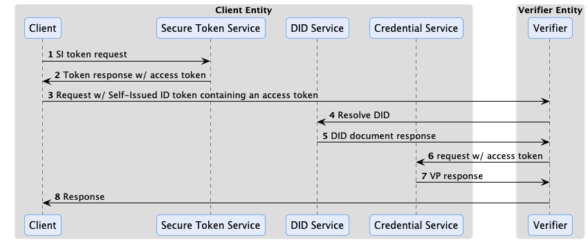

# Verifiable Presentation Protocol

## Introduction

This specification defines a protocol for storing and presenting Verifiable Credentials (VC) and other identity-related
resources. The Verifiable Presentation Protocol (VPP) covers the following aspects:

- Endpoints and message types for storing identity resources belonging to a holder in a `Credential Service`
- Endpoints and message types for resolving identity resources
- Secure token exchange for restricting access to CS endpoints

> Note that management endpoints for creating resource contexts, deleting resources, and defining access control are
> outside the scope of this protocol.

### Motivation

The Verifiable Presentation Protocol (VPP) is designed to address the problem of resolving Verifiable Presentations and
other claims when they cannot be passed as part of a client request. For example, VPs often cannot be passed as part of
an HTTP message header due to size restrictions. The protocol provides a secure mechanism for endpoints to resolve
client resources. As part of this issue, the VPP also addresses how VC issuers can request the holder's CS to store
issued credentials.

### Terms

- **Credential Service** - A network-accessible service that manages identity resources.
- **Holder** - An entity that possesses a set of identity resources as defined by
  the W3C [[[vc-data-model]]]. The holder will typically be the subject of
  a VC.
- **Resource** - A resource is an entity managed by the Credential Service such as a Verifiable Credential (
  VC) or Verifiable Presentation (VP).
- **Subject** - The target of a set of claims contained in a VC as defined by
  the [[[vc-data-model]]]. In a dataspace, a subject will be a participant.
- ***DID*** - A decentralized identifier as defined by [[[did-core]]].

### Json-Ld Context

The VPP is based on Json-Ld message types. The CS Json-Ld context is:

`https://w3id.org/tractusx-trust/v0.8`

### The Base URL

All endpoint URLs in this specification are relative. The base URL is implementation specific and may include
additional context information such as a sub-path that disambiguates a holder.

## Presentation Flow

Below is a sequence where the client uses the OAuth 2 client credential grant flow as defined in
section [[[#identity-protocol-base]]] Specification:



In the above sequence, the STS acts as an authorization endpoint for the client CS. The client requests a self-issued
token including the `bearer_access_scope` authorization parameter set to an array of scopes that define the VPs the
client wants the Verifier to have access to. This list of scopes is determined out of band and may be derived from
metadata the verifier has previously made available to the client.

The client receives the Self-Issued ID Token (containing an access token based on the `bearer_access_scope` value) and
provides it with a request to access protected resources to the verifier. The verifier extracts the access token and
uses it to request VPs from the client's CS. The verifier may resolve the CS endpoint through a variety of methods,
for example, by resolving the client's DID document and using a service entry as described
in section [[[#cs-endpoint-resolution-through-did-documents]]]. The VPs are then returned to the Verifier.


## Security

CS endpoints may require an access token obtained from the resource owner. For example, a client (the resource owner)
that needs to present a VP to an endpoint will provide an access token to the endpoint. The endpoint server will in turn
use the access token when resolving the VP through a request to the client's Credential Service.

The format of the access token is not defined. The only requirement is that the token can be used by the Credential
Service to perform an access control check as defined in section [[[#access-scopes]]] .

### Access Scopes

Scopes are used to specify access privileges. A scope is a string value in the form:

`[alias]:[descriminator]:[read|write|all]`

The `[alias]` value may be implementation-specific. The `all` value indicates both read and write access.

#### The `org.eclipse.tractusx.vc.type` Alias

The `vc.type` alias value must be supported and is used to specify access to a verifiable credential by type. For
example:

`org.eclipse.tractusx.vc.type:Member:read`

denotes read-only access to the VC type `Member` and may be used to request a VC or VP.

#### The `org.eclipse.tractusx.vc.id` Alias

The `org.eclipse.tractusx.vc.id` alias value must be supported and is used to specify access to a verifiable credential
by id. For example:

`org.eclipse.tractusx.vc.id:8247b87d-8d72-47e1-8128-9ce47e3d829d:read`

denotes read-only access to the VC identified by `8247b87d-8d72-47e1-8128-9ce47e3d829d` and may be used to request a VC
or VP.

#### The `*` Wildcard Alias

Implementations must also support the `*` wildcard:

`org.eclipse.tractusx.vc.type:*:write`

The above expression enables write-only access to all VCs.

### Access Control

How access control is defined in a Credential Service is implementation-specific. Implementations may
provide the ability to selectively restrict access to resources. The access control mechanism must support the scope
restrictions defined in section [[[#access-scopes]]]. Implementations may support additional restriction methods,

including requiring the requester to present its own VPs.

## Submitting an Access Token

Implementations that support access control require an access token. To provide the opportunity for `Credential Service`
implementations to enforce proof-of-possession, the access token MUST be contained in the `token`
claim of a self-issued identity token as definedin section [[[#self-issued-id-tokens]]]. The self-issued token MUST
be submitted in the HTTP `Authorization` header prefixed with `Bearer` of the request.

## Resolution API

If a client is not authorized for an endpoint request, the Credential Service may
return `4xx Client Error`. The exact error code is implementation-specific.

### Presentations

#### Query For Presentations

Presentations can be queried by POSTing a `PresentationQueryMessage` message to the query endpoint:

`POST /presentations/query`

The POST body is a `PresentationQueryMessage` JSON object with the following properties:

- `@context`: REQUIRED. Specifies a valid Json-Ld context ([[json-ld11]], sect. 3.1).
- `@type`: REQUIRED. A string specifying the `PresentationQueryMessage` type.
- `presentationDefinition`: OPTIONAL. A valid `Presentation Definition` according to
  the [Presentation Exchange Specification](https://identity.foundation/presentation-exchange/spec/v2.0.0/#presentation-definition).
- `scope`: OPTIONAL. An array of scopes.

A `PresentationQueryMessage` MUST contain either a `presentationDefinition` or a `scope` parameter. It is an error to
contain both.

The following are non-normative examples of the JSON body:

```json
{
  "@context": [
    "https://w3id.org/tractusx-trust/v0.8",
    "https://identity.foundation/presentation-exchange/submission/v1"
  ],
  "@type": "PresentationQueryMessage",
  "scope": []
}
```

```json
{
  "@context": [
    "https://w3id.org/tractusx-trust/v0.8",
    "https://identity.foundation/presentation-exchange/submission/v1"
  ],
  "@type": "PresentationQueryMessage",
  "presentationDefinition": "..."
}
```

##### Presentation Definitions

Implementations MAY support the `presentationDefinition` parameter. If they do not, they MUST
return `501 Not Implemented`. The `presentationDefinition` parameter contains a valid `Presentation Definition`
according to
the [Presentation Exchange Specification](https://identity.foundation/presentation-exchange/spec/v2.0.0/#presentation-definition).
The CS may require an authorization token to authorize the request and uses the presentation definition to return a set
of matching VPs in the format specified by the definition.

##### Scopes

Implementations MAY support requesting presentation of Verifiable Credentials using OAuth 2.0 OAuth 2.0 scope values.

Such a scope value MUST be an alias for a well-defined Presentation Definition. The specific scope values, and the
mapping between a certain scope value and the respective Presentation Definition is out of scope of this specification.

##### Response

The response type of a presentation query is a `PresentationResponseMessage` with the following parameters:

- `@context`: REQUIRED. Specifies a valid Json-Ld context ([[json-ld11]], sect. 3.1).
- `@type`: REQUIRED. A string specifying the `PresentationResponseMessage` type.
- `presentation`: REQUIRED. An array of Verifiable Presentations. The Verifiable Presentations may be strings, JSON
  objects, or a combination of both depending on the format.

The following are non-normative examples of the JSON response body:

```json
{
  "@context": [
    "https://w3id.org/tractusx-trust/v0.8"
  ],
  "@type": "PresentationResponseMessage",
  "presentation": ["dsJdh...UMetV"]
}
```

## Storage API

VCs can be written to the Credential Service by POSTing a `CredentialMessage` containing an array
of Verifiable Credentials ([[vc-data-model]]) to the `credentials` endpoint:

`POST /credentials`

If the POST is successful, credentials will be created and a HTTP `2XX` is returned.

The POST body is a `CredentialMessage` JSON object with the following properties:

- `@context`: REQUIRED. Specifies a valid Json-Ld context ([[json-ld11]], sect. 3.1).
- `@type`: REQUIRED. A string specifying the `CredentialMessage` type.
- `requestId`: REQUIRED. A string corresponding to the request id.
- `credentials`: REQUIRED. An array of `CredentialContainer` Json objects corresponding to the schema
  specified in section [[[#the-credentialcontainer-object]]].

The following is a non-normative example of the JSON body:

```json
{
  "@context": [
    "https://w3id.org/tractusx-trust/v0.8"
  ],
  "@type": "CredentialMessage",
  "credentials": [
    {
      "@type": "CredentialContainer",
      "payload": ""
    }
  ],
  "requestId": "..."
}
```

### The `CredentialContainer` Object

The `credentials` property contains an array of `CredentialContainer` objects. The `CredentialContainer` object contains
the following properties:

- `@type`: REQUIRED. A string specifying the `CredentialContainer` type.
- `payload`: REQUIRED. A [Json Literal]([[json-ld11]], sect. 4.2.2) containing the verifiable
  credential (VC).

## CS Endpoint Resolution through DID Documents

Different methods may be used by a Relying Party (as defined by the OAuth2 specification, link TBD) to resolve the
Credential Service for a client. One way is through DID documents. If a DID document is used, the client `DID document`
MUST contain at least one `Service` entry ([[did-core]], sect. 5.4) of type `CredentialService`:

```json
{
  "@context": [
    "https://www.w3.org/ns/did/v1",
    "https://w3id.org/tractusx-trust/v0.8"
  ],
  "service": [
    {
      "id": "did:example:123#identity-hub",
      "type": "CredentialService",
      "serviceEndpoint": "https://cs.example.com"
    }
  ]
}
```